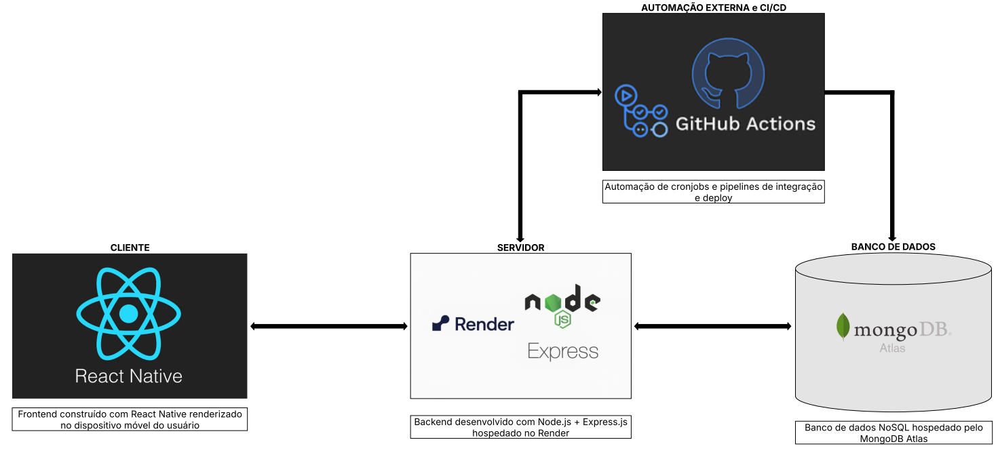

# Documento de Arquitetura

## Visão Geral

Este documento descreve a arquitetura do **UnB Navega**, seguindo as melhores práticas de engenharia de software com separação clara de responsabilidades e utilização de tecnologias modernas.



## Stack Tecnológico

### Cliente - Frontend 

* React Native com TypeScript

    * Permite desenvolvimento multiplataforma (iOS e Android) com código compartilhado

    * TypeScript adiciona tipagem estática, melhorando a manutenibilidade e reduzindo erros

    * Modelo arquitetural Feature-Based para organização modular

### Servidor - Backend

* Node.js + Express.js com TypeScript

    * Arquitetura em Camadas (Layered Architecture)

    * TypeScript para tipagem forte e melhor tooling

    * Alto desempenho e escalabilidade
    
### Hospedagem do Servidor

* Render

    * Escalabilidade sob demanda

    * Integração automática e contínua com GitHub

    * Configuração simplificada para aplicações Node.js

    * HTTPS automático e atualizações de segurança gerenciadas

### Banco de Dados

* MongoDB

    * Banco NoSQL flexível para modelagem de dados

    * Ideal para documentos JSON e integração com Node.js

    * Escalabilidade horizontal

### Automação/CI-CD

* GitHub Actions

    * Automação de pipelines de integração e deploy

    * Garante qualidade de código com testes automatizados

    * Entrega contínua eficiente

    * Cronjob de ***keep alive*** para evitar hibernação do banco de dados


## Arquitetura Detalhada
 
### Servidor - Layered Architecture

O modelo e padrão arquitetônico do **servidor - backend** é baseado na **Arquitetura em Camadas - Layered Architecture**, que organiza o sistema em níveis de responsabilidade bem definidos, promovendo separação de preocupações e facilitando a manutenção e escalabilidade do projeto.

Essa arquitetura é uma boa escolha para backend pois permite modularizar funcionalidades, isolar regras de negócio e simplificar testes, além de ser fácil de entender e adotar pela equipe.

#### Camadas Principais:

```📂 controllers/```

* Os "gerentes" que orquestram as requisições

* Recebem dados das rotas, processam e devolvem respostas

* Mantêm a lógica específica de cada endpoint

```📂 routes/```

* O "mapa" da API

* Define os caminhos (endpoints) e métodos (GET, POST, etc.)

* Conecta URLs aos controllers correspondentes

```📂 database/```

* O "conector" com o MongoDB

* Configura e gerencia a conexão com o banco de dados

* Ponto único de acesso aos dados

```📂 middlewares/```

* Os "filtros" das requisições

* Executam ações antes dos controllers (autenticação, validações)

* Podem modificar requisições/respostas

```📂 models/```

* Os "formatos" dos dados

* Definem como as informações são estruturadas no banco

* Incluem regras básicas de validação

```📂 services/```

* O "cérebro" da operação

* Contém a lógica de negócio mais complexa

* Promove reuso de código entre controllers

#### Benefícios:

* Separação clara de preocupações

* Facilidade de teste (cada camada pode ser testada isoladamente)

* Manutenibilidade aprimorada

* Baixo acoplamento entre componentes

### Cliente - Feature-Based

O **cliente - frontend** é organizado seguindo o modelo arquitetônico **Feature-Based**, que organiza o código por funcionalidades, onde cada funcionalidade possui um módulo/camada específico.

Essa abordagem é ideal para aplicações móveis porque facilita a escalabilidade, a colaboração em times grandes e a manutenção, tornando mais simples localizar, desenvolver e testar funcionalidades específicas de forma isolada.

#### Organização por Funcionalidades:

* **Cada feature contém:**

    ```📂 components/```

    * Peças reutilizáveis de UI

    * Botões, cards, inputs e outros elementos visuais

    ```📂 screens/```

    * Telas completas da aplicação

    * Combinam vários componentes

    * Normalmente associadas a rotas de navegação

    ```📂 hooks/```

    * Lógica reutilizável como estado e efeitos

    * Custom hooks para comportamentos específicos

    ```📂 services/```

    * Comunicação com APIs externas

    * Chamadas ao backend e tratamento de respostas

    ```📂 utils/```

    * Funções auxiliares (formatação, cálculos)

    * Código utilitário compartilhado

#### Benefícios:

* Localização fácil de código relacionado

* Desenvolvimento paralelo por equipes

* Reúso facilitado de funcionalidades

* Remoção segura de features não utilizadas

## Fluxo de Dados

**1.** Aplicativo (React Native) faz requisições à API

**2.** Backend (Node.js no Render) processa a requisição através das camadas

**3.** Banco de dados MongoDB utilizado quando necessário

**4.** Resposta é enviada de volta ao frontend para atualização da UI

## Benefícios do TypeScript em Todo o Projeto

* Detecção de erros em tempo de compilação

* Melhor autocompletar e documentação em IDEs

* Refatoração mais segura

* Definição clara de contratos entre módulos

* Maior confiabilidade em produção

## Considerações Finais

A arquitetura do UnB Navega combina as melhores práticas de organização de código com tecnologias modernas e eficientes, tanto a **Arquitetura em Camadas (Layered Architecture)** no backend quanto o modelo **Feature-Based** no frontend ressaltam princípios fundamentais da **Clean Architecture**, como a separação clara de módulos por responsabilidades e funcionalidades distintas.

Por fim essa separação promove benefícios importantes como:


* Alta manutenibilidade

* Boa escalabilidade

* Testabilidade aprimorada

* Melhor organização do código

* Flexibilidade para evolução futura

* Boas práticas consolidadas de engenharia de software